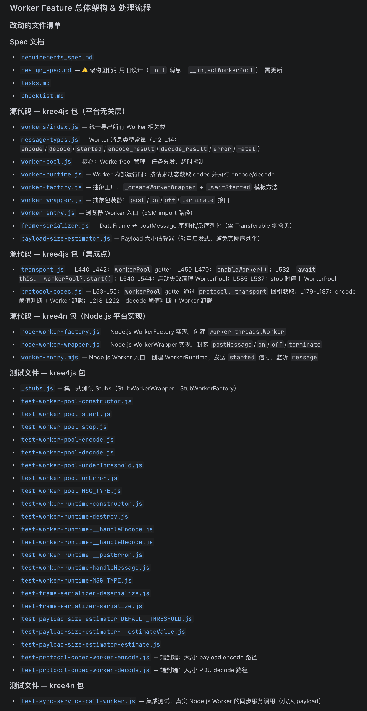
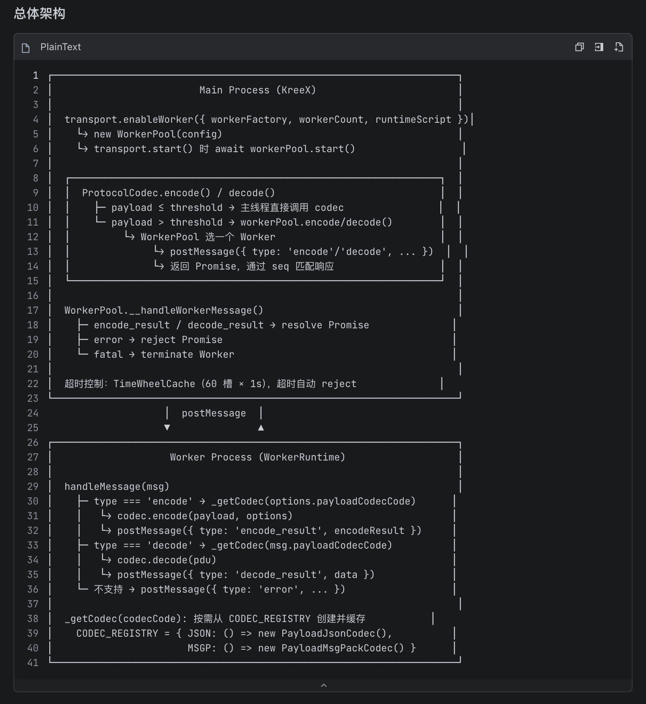
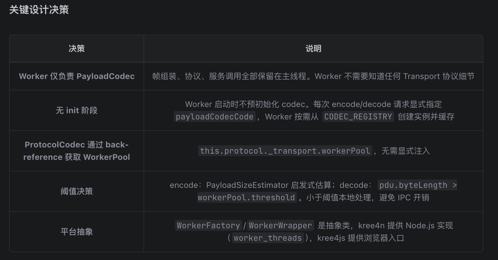
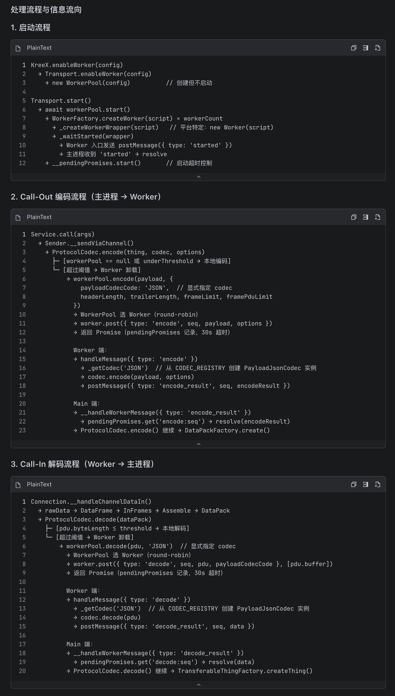
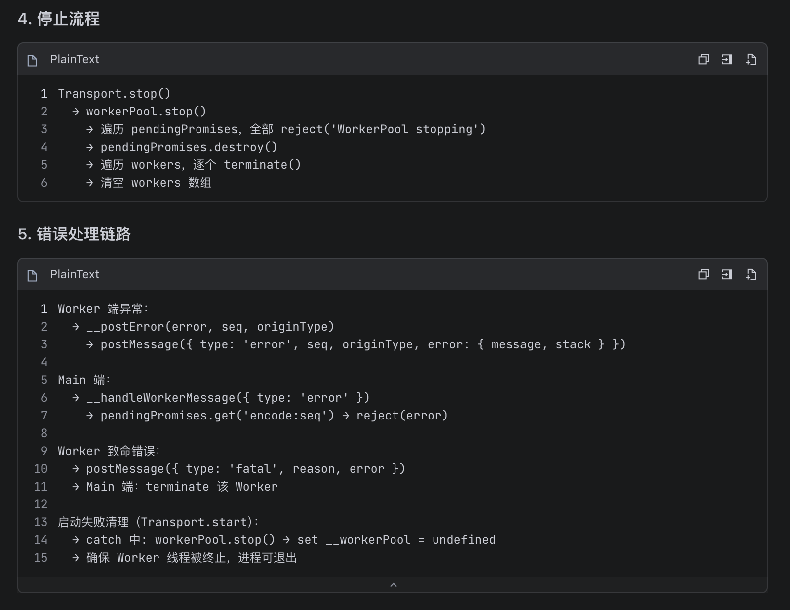
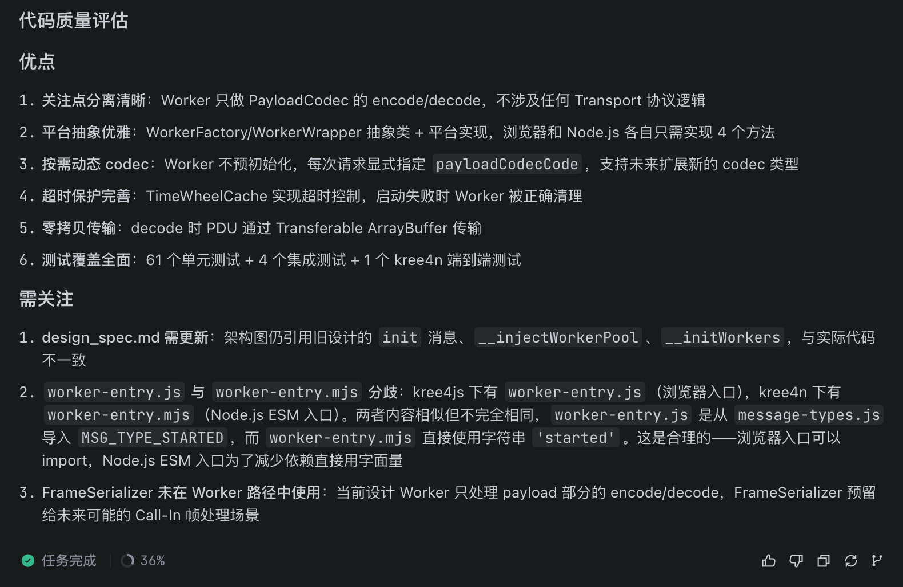
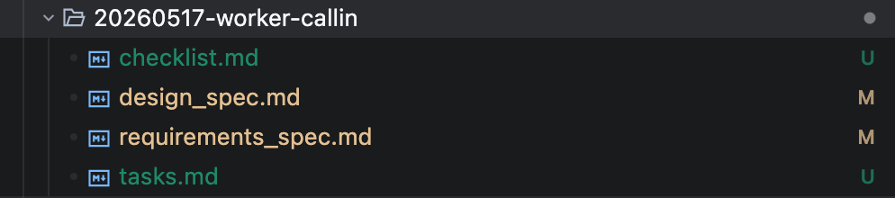

# 假象之五: 人有能力Review AI的产出

> Created By [RV](mailto:rodney.vin@gmail.com), and licensed with Creative Commons "[CC BY-NC-ND 4.0](https://creativecommons.org/licenses/by-nc-nd/4.0/)"

人类，常常有一种迷之自信，以为自己是猎人和主宰。

但是，往往会忘了，最好的猎手往往会以猎物的身份出现。

当人类，淹没于AI海量的输出，苦B地审核AI的文档、源码的时候，不知道大家会不会想起这句话。

有时候，迷茫中已经分不清楚，到底是AI在为我打工，还是我已成为了AI的奴仆。

### Review的现状

今天是2026年06月02日。

当前，很少手工写代码了，除非迫不得已。

一般的模式是，与AI一起制定SPEC，AI去实现。

AI去干活，而我，闲下来，开始BB写文章，开启喷人或自喷模式。

Trae + DeepSeek V4 Pro，实现了Kree4JS的Worker机制，而我刚刚输入了“我要review”，Trae调用了我的“**review**” SKILL。

**下边是输出：**

### 人类在Review什么

**人，在Review代码。**

这是第一位的。

如上述的截图中，我个人所做之事。

**人，在Review SDD系列的spec文档。**

这是为了控制任务的粒度、AI代码生成的规模、准确率和质量。

在AI实现Worker这个feature之前，从2026年05月17日建立这个spec以来，我和AI翻来覆去改了N回。

### 认知的落差：文本审查AI

实话实说，即使我在Skill中要求AI进行了抽象，描述了架构、流程、逻辑，看到AI输出的完整的需要我去Review的清单，第一个反应还是“畏难”。

是的，畏惧困难。

KreeX，整套书，我写的；架构，我设计的；绝大部分代码，我手写的。

架构、结构门清，细节了如指掌。

现在，只是加了一个Worker。

当完整的Feature实现后，当AI交付的文档、源代码、测试代码放在自己面前时，也会一时茫然。

其根源，在于[两难: 语言模型优先的AI与视觉优先的人类](https://zhuanlan.zhihu.com/p/2044108946550653811)

我，既讨厌看大段的技术性文本描述，也讨厌看大段的源代码。

它们，很无趣。

### 速度的落差：秒杀人类

提到速度和处境，立即想到的是芝诺的阿喀琉斯与乌龟佯谬。

不幸的是，在当前的情境下，人类不是阿喀琉斯，而是那个自以为是的乌龟。

芝诺偷换了概念，暗戳戳地隐藏了一个前提，阿喀琉斯追上乌龟后，会停下来等乌龟继续跑下一段路程后，然后再追。

而AI编程的语境下，不论偷不偷换概念，人类处理信息的速度与AI根本不在一个量级。

人类有意识的认知通道，工作记忆、决策、言语编码这条串行通道，处理信息的速度大概是40~60 bits/s，200-400词/分钟。

而AI，……

数字在这里，讲再多的话，也都是废话。

### 粒度的落差：任务越大，人类越懵B

在最早的AI自动补全阶段，就开始在IDE中使用AI，即使那时，AI还只是个玩具性质的潮物。

使用腾讯CodeBuddy时，感觉是如行云流水，如水银泻地。

而到了SDD，基本的感觉是：我的意中人是个盖世英雄，……，我猜中了前头，可是我猜不着这结局……

**而唯一重要的变化，其实是任务的粒度。**

- 自动补全时，视线不会离开当前屏幕范围。

- CodeBuddy时，指示AI去做的，仅仅是类似于IDE重构粒度的任务，rename、change signature……，我们hold得住。
- 而SDD，是以功能Feature、Task为粒度去交付的，它是一个完整的逻辑单元。

简单讲，自动补全和CodeBuddy时，我们人在主导，AI打酱油。我们思路是连贯的、认知的回路是畅通闭环的。

SDD时，AI，在内，人类，在外。

人类，实际被排除在任务粒度的逻辑单元之外。

Review SDD的产出，实质上是从外向内，去破壳，去透视一个复杂之物的过程。

这，很难。

这时，我们需要的是一个破壳器，和面向人类的可视化图形工具。

### 会制造工具的人类：专业的图形化审核工具

系统性的、专业的Review工具，从源码出发，图形化的去分析架构、交互过程、调用链路、信息流转、状态变迁，逻辑流程，这一套静态、动态分析工具，在当前是缺失的。

软件行业，在过去，没有这个需求，不存在被倒逼来提供这套专业的工具的压力。

拼拼凑凑，点点滴滴，没有全图。

结对编程，Team Review，实现者讲，Review者听，我们一般采用面对面的会议、头脑风暴方式，让更Senior的技术人员去Review下一级技术人员的输出。

传统时代，这很human，也可以work。没什么大问题。

而在AI时代，过去的一切，其存在合理性基础都要被我们打上问号，逐个质疑。

时代变了，逻辑也变了。

面对AI，人类不比AI Senior，局部的专业能力，AI吊打人类。

人类引以为傲的，可能只剩下架构级全局观、战略级的折中能力、基于直觉的方向感……

人类是工具党，人类之所以成为人类，会制造工具，是一个标志性的特征。

面对困境，我们下意识的解决办法，就是提供更好的工具。

提供一个整合式、一站式、以面向人类双通道认知模型的工具。

这个工具，以图形化为主要表述方式。

这个解决思路，会扩大人类图形认知优势，缩小人类与AI能力差距、保持对AI的可观测性、可控制性，保持人类特定能力优势。

这就是我们的计划，我们计划使用一个VSC插件来提供雏形，并在IRE中将其完善为专业化的代码审查工具。

生于IDE，终于IRE。

孩子终会长大，而父辈终会老去。

### **白盒→灰盒→黑盒，势不可免**

在[Rule 1: 软件成为灰盒，甚至黑盒](https://zhuanlan.zhihu.com/p/2028892605161697301)，我们详细讨论过，AI主导的Programming会导致软件对于人类成为灰盒，甚至黑盒。

从技术史的角度来看，软件行业的整个发展历程，就是封装粒度不断变大，模块化程度不断提高，原先的白盒不断变为黑盒的过程。

我们实际上唯一关注的是，原本的白盒演变为黑盒后，其Input/Output是否符合我们的预期、是否稳定、是否高效、是否可靠。

大道如此，不必强求。

