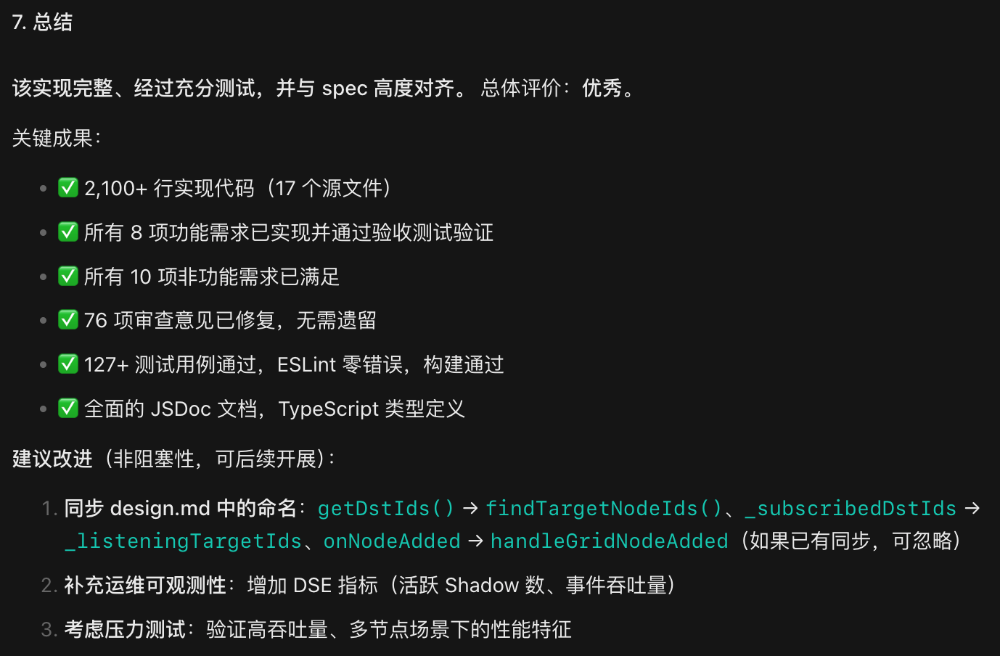

# SDD锦上添花之四：SPEC索引，AI跟随链接

> Created By [RV](mailto:rodney.vin@gmail.com), and licensed with Creative Commons "[CC BY-NC-ND 4.0](https://creativecommons.org/licenses/by-nc-nd/4.0/)"

在亚里士多德的眼中，世界潜在无限可分，不存在最后一块不能再分的最小单元。

当看见有人在得意洋洋地反问：**“*为什么你的PR会超过100行？*”**

就在想，能讲出这种话的人，是亚里士多德的忠实的徒子徒孙么？

抑或，只是Team内一个专职的**Bug Fixer**？

概念上，“无限可分”，“一个PR保持在100行以内，否则不准提交”，或可一辩。

而在工程层面，这就是太空中的球形鸡，毫无意义。为了XX而XX，是最可笑之事。

Spec是“**功能单元**”为Task粒度去划分的，而“**功能**”是个“**层展**”涌现的概念，拆分到某个粒度后继续拆分，“功能”就不再存在。

AI编程SDD的流程中，Spec身处中游，上有全局需求设计，下有Coding、Bug Fix、Review，紧要之处就在于“粒度合适”，以保持上下游图谱清晰可跟踪。

当面对一个不可再拆分的Task，使用Spec驱动此Task的实现时，如果单个Spec文档过长，将Spec转变为一个索引器，将具体的内容拆分至独立的子文档，事半而功倍。

在一个Spec目录内，保持每个文档小而精、对于AI与人类都有其特殊价值。

### 一. 要求AI跟随链接

首先，我们要确认，AI会自动跟随文档中的链接。

否则，一切都是镜花水月。

意识到这个问题后，使用主流各种AI IDE做了测试，而结论是：很不乐观。

绝大部分，不跟随，即使跟随，也是薛定谔式的跟随。

以为这是IDE未实现的功能，无奈之余问计AI。

答：“在Spec开头加入阅读要求，要求跟随。”

试了下，果然灵验。

AI编程时代，万物皆是提示词，RULEs、SKILLs、Commands、Specs……，无一例外。

### 二. 下引：分拆Spec，AI易于实现，人类易于Review

刚刚，Review调整完毕KreeX的DSE(Distributed Service EventEmitter)功能，可以归档、提交、推送了。

此功能，动意甚早，06-12建立Spec，06-15 AI完成第一个可运行版本，后续是持续不断的Review与调整。

功能，实际很简单，EventEmitter的on/off/emit而已。

RPC Service，一个dseSingularity的bangListen/bangUnlisten/bangEmit而已。

核心代码，dseInterceptor、Shadow、BlackHole、BlackHoleEventHorizon、BlackHoleSingularity，及镜像的WhiteHoleSingularity、WhiteHoleEventHorizon、WhiteHole、Emerger。

从Spec的范围看，兵不满千，将不数员。

AI初始的实现，能跑，仅此而已。

持续不断的Review调整，直至今日06-22，方才洗去了代码的AI味，有了我自己的代码风格。

其中，AI的笨拙、无意义的Token消耗，Review时，人的痛苦，一一不可言尽。

人，面对满是文字的长文档时，苦不堪言；给出Review意见时，AI无法并行更新文档，看它一处处挨个修改，徒劳等待，则是另外一种痛苦。

#### 各AI IDE、各SDD流派实际已在分拆

实际上，不论是那种AI IDE，不论是那种SDD流派，使用一个MonoDoc来维护一次任务Spec的所有内容，这不是事实。

实际的工程中，大家都在分拆：

architecture.md、proposal.md、spec.md、user-stories.md、requirement.md、design.md、task.md、checklist.md、REPORTS.md……

毕竟，“**分治**”，是程序员与生俱来的一种本能与思维定式。

AI能够识别现实中的这种分拆，一方面依靠AI IDE的系统提示词，一方面则是AI更像一个人而不是程序，给定一个目录，它会从文件名字来猜意图。

该拆，就拆，工程上有必要，能带来方便，就可以去做。

纯净论者愿意BB什么，那是他们的事情，和我们无关。

#### 独立子文档，多Agent并发工作

看AI Coding，源代码源源不断喷涌而出时，有一种快意。

而看AI改文档，则像一个小脚老太婆走路，磕磕碰碰，整体是一种Search→Locate→Replace→Verify→……的过程，看得人捉急。

并且时不时失败，“*嗯，让我来重新生成……*”

如果内容较多，将requirement.md、design.md的内容，按章节拆分到不同的md文档中，在主文档中使用链接定位子文档，则可以大幅提高AI的工作效率。

当前的主流AI IDE大多支持多Agent并行任务，分离的、独立的子文档，AI可以调度多个Agent并发修改、替换。

加入全局规则，或者自定义SKILL，要求AI生成spec.md、requirement.md、design.md时，进行内容拆分、链接跟随。

小动作，大方便。

#### 文档变小，Review更方便

梦中的、理想的Review是基于一个Review Deck去展开的。

不局限于IDE，所有的窗口中，万物皆可选中、万物皆可注解。

而当前，实际的review是：

- IDE中看md文档，是一种折磨
- IDE外看md，无法选中加入AI对话框

这个过程，满是烦躁与繁琐。

梦中的review，有一个集中式的Review Deck提供中央审计台，而各个具体的文档，也随处可显示审计Comments、Notes。

而当前，可用的只是一个在自定义SKILL约束下建立的review.md。

- **禁止修改代码**：进入 review 模式后，未经用户明确允许，禁止修改任何代码
- **问题记录**：review 模式下指出的任何问题，必须记入 spec 目录下独立的 `review.md` 文件

多条review意见被记下后，立即就需要考虑AI一次修改会影响下一次内容定位的问题：

- **实现修改**：修改前，先整体读取review.md，所列comments分析、定位到原始问题后，才可开始修改

将Spec的各个文档，必要时章节内容拆分到独立子文档中，人阅读会更轻爽，人Review会更快捷。

小方法，大方便。

### 三. 上接：C4自顶向下，通过链接构建完整的需求+设计+任务图谱

实际上，从AI时代软件工程整体流程来看：

“**下引**”，固然重要；而“**上接**”，才是整个AI自动化流程豁然可通的关键节点。

AI辅助下，按照C4模型(或者你认可的其他模型)，进行适度地、自顶向下的需求与设计，基于L4级别的产出来自然生成Spec，才是目的性更清晰、人的沉浸感、掌控感更强、LLM能力要求更低、Token消耗更少的方式。

在[《SDD锦上添花之一：使用独立工程管理SPEC》](https://zhuanlan.zhihu.com/p/2048151406260102475)中，我们讨论过使用独立工程管理Current Truth-全局需求+设计的问题。

在独立的工程中，基于模块、功能划分，自顶向下树形管理各级的需求、设计文档。

而Spec是自然的桥接器，上接了一个L4级的代码级模块。

此时，Spec文档中，Requirement.md与Design.md基础内容来自外链的“需求+设计”工程，引用独立文档、章节、行，这构成了自上而下一贯而通的完整的“需求+设计+任务”图谱。

创建Spec时，引用树形结构一个叶子节点所分割出的L4级别的任务定义，派生创建，这种工作方式，避免了新建一个spec时成本巨大的、漫无目的的Exploring阶段，更符合人的思维模式、更自然、顺畅。

#### 四. 工具：规范化、自动化 Spec索引过程

手工，或者依靠RULEs、SKILLs去实现“C4自顶向下，通过链接构建完整的需求+设计+任务图谱”，这个过程也是苦不堪言。

没有一个可视化的工具，这个过程，基本是不可行的。

短期内，我们需要AI IDE原生支持，或者我们提供插件来支持，将整个自顶向下、拆分、链接的整个过程AI化、规范化、自动化。

投入不大，而效果立即可见。

Working，努力工作中，试图提供一个VSC插件……

**附，不用去翻找，本系列完整清单：**

**Spec系列：**

- 问题与边界

  - [Developer的错觉：SPEC是谁的?](https://zhuanlan.zhihu.com/p/2043647777096324060)

  - [黑色幽默: Console之Back To The Future](https://zhuanlan.zhihu.com/p/2043776466085745079)

  - [两难: 语言模型优先的AI与视觉优先的人类](https://zhuanlan.zhihu.com/p/2044108946550653811)

  - [假象之一: AI无所不能](https://zhuanlan.zhihu.com/p/2044167534631441066)

  - [假象之二: 意图驱动开发](https://zhuanlan.zhihu.com/p/2044510121695376754)

  - [假象之三: SPEC是唯一的事实来源](https://zhuanlan.zhihu.com/p/2044790057106764551)

  - [假象之四: 轻设计的传统敏捷依然有效](https://zhuanlan.zhihu.com/p/2044866444647715551)

  - [假象之五: 人有能力Review AI的产出](https://zhuanlan.zhihu.com/p/2045114498730742818)

  - [图形化驾驭AI：AI约束与Review，所为和所不为](https://zhuanlan.zhihu.com/p/2045254917414286172)
- [SDD 不仅是当前的最佳实践，也是更远大未来的最好起点](https://zhuanlan.zhihu.com/p/2045836539951837578)
  - [Dev的自我升级：如何使用SDD引入AI辅助编程？](https://zhuanlan.zhihu.com/p/2046246004358378053)
  - [SDD锦上添花之一：使用独立工程管理SPEC](https://zhuanlan.zhihu.com/p/2048151406260102475)
  - [SDD锦上添花之二：直面SPEC碎片化，反向拼合治标，主动破碎治本](https://zhuanlan.zhihu.com/p/2051035115514508351)
  - [SDD锦上添花之三：Spec过时就过时，任务完成就好](https://zhuanlan.zhihu.com/p/2051377484961260522)

