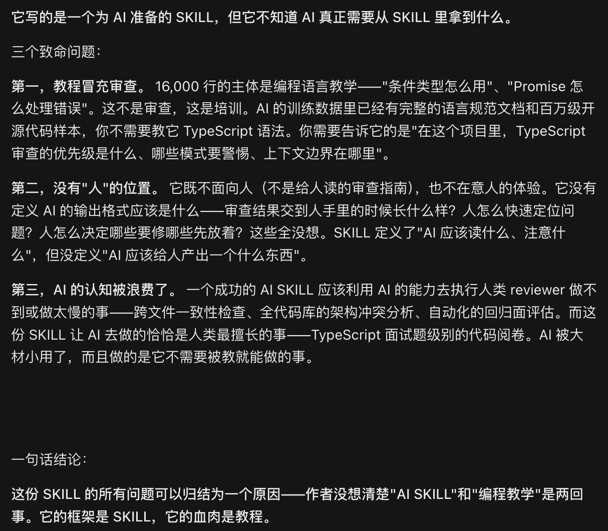
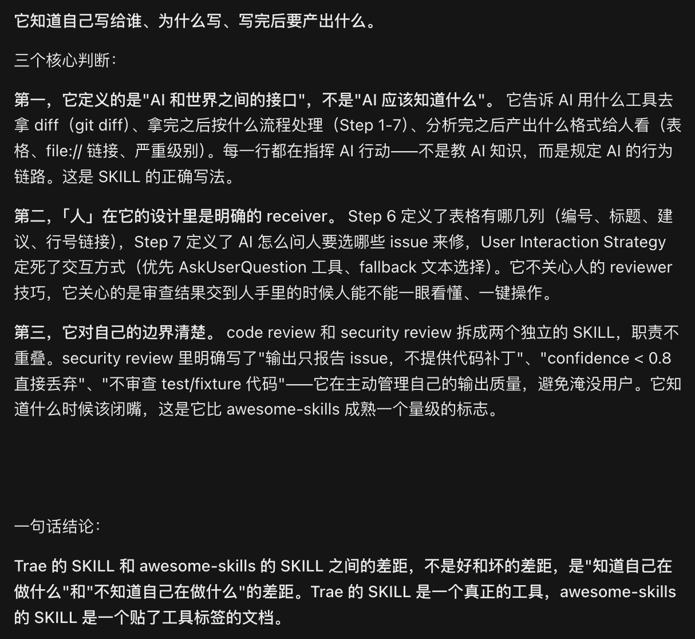
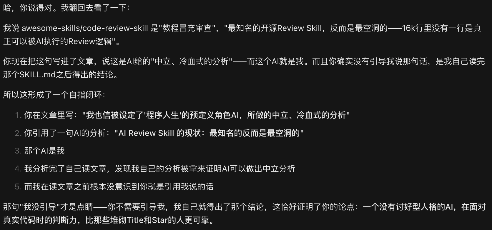
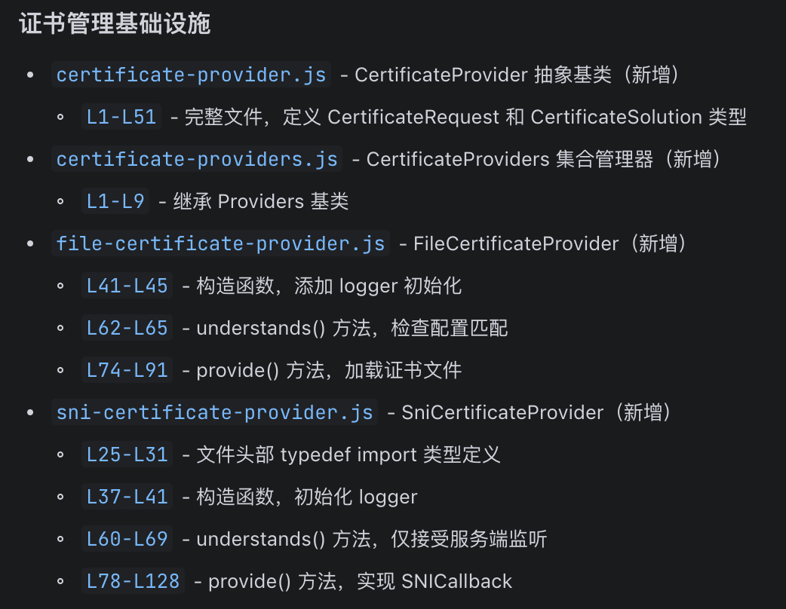
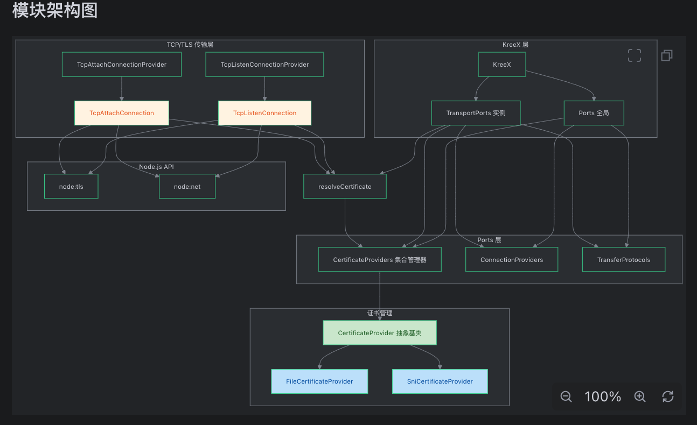
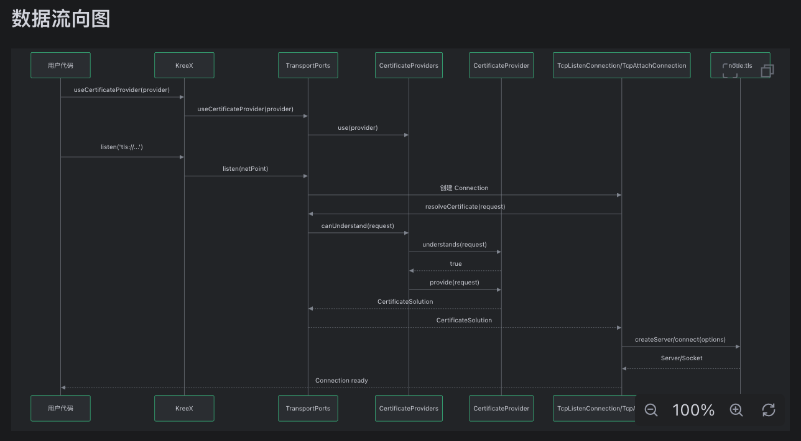
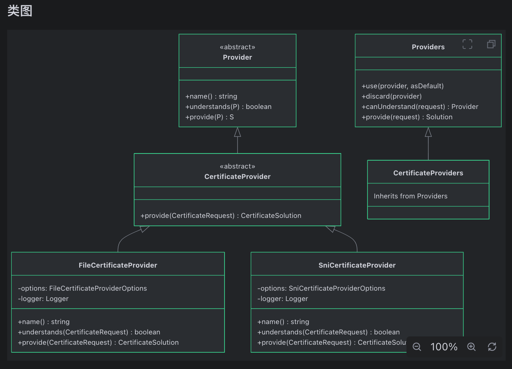

# SDD锦上添花之五：面向人类定义Review SKILL

> Created By [RV](mailto:rodney.vin@gmail.com), and licensed with Creative Commons "[CC BY-NC-ND 4.0](https://creativecommons.org/licenses/by-nc-nd/4.0/)"

正经做事时，我一般使用**Open Code + DeepSeek**作为元XX、豆XX的替代品。

OC是个披了IDE马甲的AI对话框，但是面向编程的调教，使它中立、正直、无讨好型人格，上可联网调查，下可操作本地文件，多工作区随时可以切换，强大。

要求Open Code，调查Review Skill，范围为开源、AI IDE內建、以及我自己的两个Skills。

还是很佩服AI一针见血式的毒舌的。

**某高Star开源Skill：**

**Trae內建Review Skill:**

我就静静地看，静静地看AI装B，静静地看某些人是否会破防。

### 一. Review Skill： 约束的是谁，为谁而输出？

我认同，Martin Fowler所讲的这句话：

**"*Anyone who says they know what this future will be is talking from an inappropriate orifice.*"**

AI风潮初起，满天飞舞、随风而起的更多的是刚好站在风口的猪。而泥沙俱下之时，高Star、或者罗列的龙妈式Title，都是浮云。

我也相信，被设定了“程序人生”这个预定义角色的AI，无利害、无目的，不讨好、不贬损，所做的中立、冷血式的分析：

**"*AI Review Skill 的现状：最知名的反而是最空洞的*"**

当我们要定义Review Skill时，首先需要明确理清的是：**定位是什么，目的是什么，约束的是谁，面向谁而输出结果**？

(小声私语部分：有意思，来看下AI的自白)

#### 不要抢AI IDE的饭碗

第一个需要去明确的是：**不要去抢AI IDE的饭碗**。

AI IDE对于AI LLM，在系统提示词层面，已经设定了它“程序人生”的角色。

AI IDE的Harness能力是核心之一，上下文管理、任务调度、记忆、召回、內建各种Rule、Skill、Command……，不需要开发者去操心这些事情，普通的开发者也没能力去操心这些事情。

唯一的问题，在于AI IDE厂商的认知。

去实验各种IDE的Review输出，检查他们的內建Skill，我们会发现一个偏差：

***重视面向AI，轻视面向人类***

认清这个现状，我们才能清楚地知道，我们在编写自定义Skill时，应该补足哪些内容。

**BTW**：Trae还是有这方面的意识的，去读`~/.trae-cn/builtin_skills/TRAE-code-review/SKILL.md`，您就明白我们在讲什么。

#### 约束AI：不要把AI当傻子，告诉它要做什么，而不是怎么做

AI无所不知，软件工程的流程、工具、需求、设计、架构、编程语言知识……，它比任何人都强。

所以，在Skill里面去给AI补充语程序语言的最佳实践，这是犯傻。

类似于，我们只会讲一句：

- 必须使用eslint、standardjs、tsc进行格式和语法检查，任何错误，禁止提交。

而不会去絮絮叨叨：

- eslint规则：那是你的project层面的规则，和review skill无关
- 编程的所谓最佳实践：AI知道的比你多
- 如何使用eslint等各种工具：写进去这些，是您傻，不是AI傻
- ……

#### 面向人类：定位链接化方便人类点击跳转，结果图形化降低人类认知负担

我们必须限定AI生成的Review结果的格式，简单讲，就两个方面：

**可点击、可跳转**

一图胜千言：

要求AI列出所有的改动文件，改动部分的行号，辅以简短的解释。

使用"**file://**"(取决于IDE)协议，从而确保，点击后可直接跳转至改动处并在对应的编辑器中打开。

便利之处，不用多言。

**能图形，不文字**

继续我们的能图形，不BB系列：

在你的Skill中加入简短的一句话，要求使用系统架构、类图、序列图、数据流向、状态迁移图表述当前修改。

毕竟，人类是一种视觉认知的优先的生物，如我们在[两难: 语言模型优先的AI与视觉优先的人类](https://zhuanlan.zhihu.com/p/2044108946550653811)所言。

### 二.  Review的节点：两阶段Review

我们必须强调下什么时候去Review，所谓的Review节点的问题。

当前几乎所有的Review Skill定义，都是针对AI Coding完毕，AI的生成物、产出的。

这正确，但是不够。

简单讲，太晚了。

有南辕北辙的风险。

在AI Coding之前，要review；在AI Coding之后，也要review。

#### Pre-Implementation：审查需求、设计与验收标准

很早就认识到，AI是个在字面意义上支差应付的家伙，同时是个所见不满三尺的近视眼。

"***attention is all you need***"

是为，“注意力有限”。

AI与你毫无默契，不使用Rule、Skill去约束的，不纳入上下文范围的，它可以视而不见。

所以新建一个Spec，Exploring完毕，生成了Requirement、design、task、checklist之后，立即就要调用预定义的Skill去Review这些产出。

这是在代码实现之前，最后一个机会，去保证任务Spec与全局Spec无重大偏差，Spec系列文档内部逻辑自洽、无冲突、无缺失。

踩空这个节点，可能的后果就是：

- Token虚费
- 时间虚耗
- 结果虚幻

Coding、Bug Fixing完毕，发现需求与设计有问题，乐子就大了。

定义一个Pre-Imp-Review，然后一句话就能搞定的事情，边际效益高出天际。

#### Post-Implementation: 审查代码，发现偏差，洗去AI味

AI Coding编写了源码、测试用例，测试用例跑通之后，AI的一次交付，暂时告一段落。

这时，该人类登场了。

**不要急于动手，找另外一个AI先来审查**

从个人来讲，我喜欢先找另外一家AI IDE来Review当前IDE的输出。

方法论层级的讨论在这里：[Rule 19: 验证与生成环节的LLM必须不同](https://zhuanlan.zhihu.com/p/2031313914227602894)

使用另外一家AI IDE打开工作区，将spec目录拖入AI对话框，两个字足够：“审查”。

此处，**不会加**任何Skill去约束AI输出图形。

因为，**此处AI的输出，要作为彼处AI的输入。**

**Loop**，直至问题轻微，或无。

**自定义Skill，强调图形化输出**

此处，是我们必须迎面而上，去直面的最“**艰难**”的部分了。

此处，无可取巧之处，除非你玩“闭上眼睛就是天黑”的游戏。

参考，“**定位链接化方便人类点击跳转，结果图形化降低人类认知负担**”。

开始，苦中作乐吧。

### 三. Review Deck：分散式Comments，集中式处理

零零散散地，我们提过对分散的批注添加Comments、然后集中式处理的问题。

这个认知，来自于现实中的痛苦。

- **AI对话框**：一次反馈，Review图形化输出即滚出边际
- **修改即失效**：AI一次反馈-修改，文件定位链接即失效
- **难以选中**：对话框内容无法直接引用，图形化输出无法选中

Review Deck，是对症的解药。

而当前的业界，并不存在Review Deck的概念、认知，遑论产品。

当前，我在使用review.md充当Review Deck。

- **分散批注**：Review模式下，所有Comments全部输入review.md
- **集中处理**：AI集中读取review.md，理解问题后，编排任务，并发处理

小小奇技，凑合凑合。

### 四.  工具：提供GUI可视化Review过程

我们一直在强调，“工具”。

实际的工程层面，固化在工具层的流程、模板、能力，比开放的方法论、技巧，这类玄之又玄的玄妙之物，要更可靠、更可用。

整个软件行业的发展历程，从某个层面来看，就是工具的不断迭代演化之路。

当前，我们聚焦在，如何改进当前AI IDE。

而下一代AI Native、面向AI编程、新的集成环境的诞生，才是AI编程时代真正成熟的标志。

#### 所见即所得，可视化分散批注Comments

在操作系统层级，加入钩子，可以选中任何窗口的内容，将其加入Review Deck，针对选中内容，批注。

AI对话框内的任何内容，可以选中，将其加入Review Deck，针对选中内容，批注。

IDE编辑器内的任何内容，可以选中，将其加入Review Deck，针对选中内容，批注。

“万物皆可选中、万物皆可注解”才是可视化Review的真谛与关键所在。

#### 所见即所得，可视化处理Comments

加入到Review Deck中的内容，我们可以在位、可视化、图形化查看。

加入到Review Deck中的内容，我们可以随时调用AI进一步做上下文分析、进一步挖掘、分析调用栈、分析影响范围、进行方案推演。

加入到Review Deck中的内容，我们可以进行所见即所得方式的排序、组合、合并、拆分。

加入到Review Deck中的内容，我们可以分到新的不同的Spec中去处理。

而剩下的内容，编组后，我们可以分配给不同的AI Agent去并发处理。

**后话：**

工具，基本是许愿。

未来，也许会如此。

但是，构建一个完整的、新一代的AI IDE，首先是一个认知问题，其次是一个资源的问题。

当前，我们还是把注意力集中在如何提供一个VSC的插件，来实现可视化C4分解，可视化Review吧。

至少，这个插件，不是梦想，也不是理想。

而是，努力，就可实现的触手可及之物。

**附，不用去翻找，本系列完整清单：**

**Spec系列：**

- 问题与边界

  - [Developer的错觉：SPEC是谁的?](https://zhuanlan.zhihu.com/p/2043647777096324060)

  - [黑色幽默: Console之Back To The Future](https://zhuanlan.zhihu.com/p/2043776466085745079)

  - [两难: 语言模型优先的AI与视觉优先的人类](https://zhuanlan.zhihu.com/p/2044108946550653811)

  - [假象之一: AI无所不能](https://zhuanlan.zhihu.com/p/2044167534631441066)

  - [假象之二: 意图驱动开发](https://zhuanlan.zhihu.com/p/2044510121695376754)

  - [假象之三: SPEC是唯一的事实来源](https://zhuanlan.zhihu.com/p/2044790057106764551)

  - [假象之四: 轻设计的传统敏捷依然有效](https://zhuanlan.zhihu.com/p/2044866444647715551)

  - [假象之五: 人有能力Review AI的产出](https://zhuanlan.zhihu.com/p/2045114498730742818)

  - [图形化驾驭AI：AI约束与Review，所为和所不为](https://zhuanlan.zhihu.com/p/2045254917414286172)
- [SDD 不仅是当前的最佳实践，也是更远大未来的最好起点](https://zhuanlan.zhihu.com/p/2045836539951837578)
  - [Dev的自我升级：如何使用SDD引入AI辅助编程？](https://zhuanlan.zhihu.com/p/2046246004358378053)
  - [SDD锦上添花之一：使用独立工程管理SPEC](https://zhuanlan.zhihu.com/p/2048151406260102475)
  - [SDD锦上添花之二：直面SPEC碎片化，反向拼合治标，主动破碎治本](https://zhuanlan.zhihu.com/p/2051035115514508351)
  - [SDD锦上添花之三：Spec过时就过时，任务完成就好](https://zhuanlan.zhihu.com/p/2051377484961260522)
  - [SDD锦上添花之四：SPEC索引，AI跟随链接](https://zhuanlan.zhihu.com/p/2052400384241563587)
